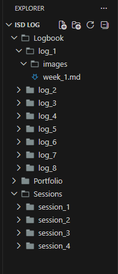

# Session 1: Introduction to Python Programming I

- [Session 1: Introduction to Python Programming I](#session-1-introduction-to-python-programming-i)
  - [Section 1 Setting up code editor](#section-1-setting-up-code-editor)
    - [Exercise Task 1 : Setup](#exercise-task-1--setup)
    - [Exercise Task 2 : Working Folder](#exercise-task-2--working-folder)
    - [Exercise Task 3 : Run Demo File](#exercise-task-3--run-demo-file)
  - [Section 2 Python Introduction](#section-2-python-introduction)
    - [Exercise 1 Task 1 : Variable and Types](#exercise-1-task-1--variable-and-types)
    - [Exercise 1 Task 2 : Casting Variables](#exercise-1-task-2--casting-variables)
    - [Exercise 2 Task 1 : Arithmetic Operators](#exercise-2-task-1--arithmetic-operators)
    - [Exercise 2 Task 2 : Calculating the Average](#exercise-2-task-2--calculating-the-average)
    - [Exercise 2 Task 3 : Area of Rectangle](#exercise-2-task-3--area-of-rectangle)
    - [Exercise 3 Task 1 : String and f-String](#exercise-3-task-1--string-and-f-string)
    - [Exercise 3 Task 2 : f-String](#exercise-3-task-2--f-string)
  - [Section 3 First Temperature Converter Program](#section-3-first-temperature-converter-program)

## Section 1 Setting up code editor

### Exercise Task 1 : Setup

Install Visual Studio Code from [this link](https://code.visualstudio.com).
After installation, open VS Code and confirm Python extension support is available.

### Exercise Task 2 : Working Folder

Download the starter resources from Aula.
Keep the same folder layout for `Logbook`, `Portfolio`, and `Sessions`.

Reference folder structure:



### Exercise Task 3 : Run Demo File

```python
# Demo program for Session 1

print("Hello from ISD Session 1")
print("Python script executed correctly")

module_name = "ISD"
student_count = 22
line_a = "Welcome to " + module_name + ". Students enrolled: " + str(student_count)
print(line_a)

line_b = f"Welcome to {module_name}. Students enrolled: {student_count}"
print(line_b)
```

Output

```console
PS D:\assignments\t2\ISD\ISD log> & C:\Users\ujjwa\AppData\Local\Python\pythoncore-3.14-64\python.exe "d:/assignments/t2/ISD/ISD log/Sessions/session_1/lab_week_1.py"
Hello from ISD Session 1
Python script executed correctly
Welcome to ISD. Students enrolled: 22
Welcome to ISD. Students enrolled: 22
```

---

## Section 2 Python Introduction

### Exercise 1 Task 1 : Variable and Types

```python
# Exercise 1 Task: Variables and Types
is_active = False      # bool
attempts = 7           # int
temperature = 19.75    # float
welcome_text = "Hello ISD"  # str

print(type(is_active))
print(type(attempts))
print(type(temperature))
print(type(welcome_text))
```

Output

```console
PS D:\assignments\t2\ISD\ISD log> & C:\Users\ujjwa\AppData\Local\Python\pythoncore-3.14-64\python.exe "d:/assignments/t2/ISD/ISD log/Sessions/session_1/lab_week_1_part2.py"
<class 'bool'>
<class 'int'>
<class 'float'>
<class 'str'>
```

### Exercise 1 Task 2 : Casting Variables

```python
# Exercise 1 Task: Casting Variables
count = 12
score = 88.9
is_passed = False
print("count =", count, "score =", score, "is_passed =", is_passed)

count_to_float = float(count)
print("count_to_float =", count_to_float)

score_to_int = int(score)
print("score_to_int =", score_to_int)

passed_to_int = int(is_passed)
print("passed_to_int =", passed_to_int)
```

Output

```console
PS D:\assignments\t2\ISD\ISD log> & C:\Users\ujjwa\AppData\Local\Python\pythoncore-3.14-64\python.exe "d:/assignments/t2/ISD/ISD log/Sessions/session_1/lab_week_1_part2.py"
count = 12 score = 88.9 is_passed = False
count_to_float = 12.0
score_to_int = 88
passed_to_int = 0
```

### Exercise 2 Task 1 : Arithmetic Operators

```python
# Exercise 2 Arithmetic operators

#Addition
result_addition = 14 + 6
print("Addition:", result_addition)

#Subtraction
result_subtraction = 30 - 11
print("Subtraction:", result_subtraction)

#Multiplication
result_multiplication = 7 * 5
print("Multiplication:", result_multiplication)

#Division
result_division = 40 / 8
print("Division:", result_division)

#Floor Division
result_floor_division = 29 // 6
print("Floor Division:", result_floor_division)

#Modulus
result_modulus = 29 % 6
print("Modulus:", result_modulus)

#Exponentiation
result_exponentiation = 3 ** 4
print("Exponentiation:", result_exponentiation)
```

Output

```console
PS D:\assignments\t2\ISD\ISD log> & C:\Users\ujjwa\AppData\Local\Python\pythoncore-3.14-64\python.exe "d:/assignments/t2/ISD/ISD log/Sessions/session_1/lab_week_1_part2.py"
Addition: 20
Subtraction: 19
Multiplication: 35
Division: 5.0
Floor Division: 4
Modulus: 5
Exponentiation: 81
```

### Exercise 2 Task 2 : Calculating the Average

```python
# Task 2: Calculating the Average:

mark1 = 64
mark2 = 82
average_mark = (mark1 + mark2) / 2
print("mark1:", mark1)
print("mark2:", mark2)
print("Average:", average_mark)
```

Output

```console
PS D:\assignments\t2\ISD\ISD log> & C:\Users\ujjwa\AppData\Local\Python\pythoncore-3.14-64\python.exe "d:/assignments/t2/ISD/ISD log/Sessions/session_1/lab_week_1_part2.py"
mark1: 64
mark2: 82
Average: 73.0
```

### Exercise 2 Task 3 : Area of Rectangle

```python
# Task 3: Calculate the Area of a Rectangle:

length = 9
width = 4
area = length * width
print("Rectangle length:", length)
print("Rectangle width:", width)
print("Rectangle area:", area)
```

Output

```console
PS D:\assignments\t2\ISD\ISD log> & C:\Users\ujjwa\AppData\Local\Python\pythoncore-3.14-64\python.exe "d:/assignments/t2/ISD/ISD log/Sessions/session_1/lab_week_1_part2.py"
Rectangle length: 9
Rectangle width: 4
Rectangle area: 36
```

### Exercise 3 Task 1 : String and f-String

```python
# Task 1: Modify Strings:

my_string = "Python labs are practical."
print("Original:", my_string)

my_uppercase_string = my_string.upper()
print("Upper:", my_uppercase_string)

my_lowercase_string = my_string.lower()
print("Lower:", my_lowercase_string)

my_new_string = my_string.replace("practical", "important")
print("Replaced:", my_new_string)

my_string_length = len(my_string)
print("Length:", my_string_length)
```

Output

```console
PS D:\assignments\t2\ISD\ISD log> & C:\Users\ujjwa\AppData\Local\Python\pythoncore-3.14-64\python.exe "d:/assignments/t2/ISD/ISD log/Sessions/session_1/lab_week_1_part2.py"
Original: Python labs are practical.
Upper: PYTHON LABS ARE PRACTICAL.
Lower: python labs are practical.
Replaced: Python labs are important.
Length: 26
```

### Exercise 3 Task 2 : f-String

```python
# Task 2: f-Strings

my_name = "Uttam Pradhan"
my_number_of_classes = 3
my_campus = "Paisley Campus"

my_text = f"I am {my_name}. I study {my_number_of_classes} classes at {my_campus}."
print(my_text)
```

Output

```console
PS D:\assignments\t2\ISD\ISD log> & C:\Users\ujjwa\AppData\Local\Python\pythoncore-3.14-64\python.exe "d:/assignments/t2/ISD/ISD log/Sessions/session_1/lab_week_1_part2.py"
I am Uttam Pradhan. I study 3 classes at Paisley Campus.
```

---

## Section 3 First Temperature Converter Program

```python
# Section 3: First Program in Python

celsius_input = 18
degree_f = (float(celsius_input) * 9/5) + 32
degree_k = float(celsius_input) + 273.15
output = f"Celsius: {celsius_input}°C\nFahrenheit: {degree_f}°F\nKelvin: {degree_k}K"
print(output)
```

Output

```console
PS D:\assignments\t2\ISD\ISD log> & C:\Users\ujjwa\AppData\Local\Python\pythoncore-3.14-64\python.exe "d:/assignments/t2/ISD/ISD log/Sessions/session_1/temperature_converter.py"
Celsius: 18°C
Fahrenheit: 64.4°F
Kelvin: 291.15K
```
