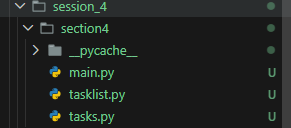

- [Session 4 : Classes and Objects](#session-4--classes-and-objects)
  - [Portfolio Structure for Week 4](#portfolio-structure-for-week-4)
  - [Session\_4 Structure](#session_4-structure)
  - [Section 1 Python Classes](#section-1-python-classes)
    - [Exercise 1 Task 1: Creating Classes and Initializing Objects](#exercise-1-task-1-creating-classes-and-initializing-objects)
    - [Exercise 1 Task 2: Adding, Deleting, Viewing Methods to a Class](#exercise-1-task-2-adding-deleting-viewing-methods-to-a-class)
    - [Exercise 1 Task 3: Testing the Functionality](#exercise-1-task-3-testing-the-functionality)
    - [Exercise 1 Task 4: Composition](#exercise-1-task-4-composition)
    - [Exerxise 1 Task 5: Developing Task](#exerxise-1-task-5-developing-task)
  - [Section 2 Python Libraries](#section-2-python-libraries)
    - [Exercise 2 Task 1: Adding Dates](#exercise-2-task-1-adding-dates)
  - [Section 3 Modularizing your Code](#section-3-modularizing-your-code)
    - [Exercise 3 Task 1: Restructuring](#exercise-3-task-1-restructuring)
    - [Exercise 3 Task 2: Main()](#exercise-3-task-2-main)
  - [Section 4 Type Checking and Documenting your Code](#section-4-type-checking-and-documenting-your-code)
    - [Exercise 4 Task 1: Type Checking](#exercise-4-task-1-type-checking)
    - [Exercise 4 Task 2: Docstrings and Comments](#exercise-4-task-2-docstrings-and-comments)
  - [Section 5 Portfolio Exercises](#section-5-portfolio-exercises)
    - [Exercise 5 Task 1: Portfolio Exercise 1](#exercise-5-task-1-portfolio-exercise-1)
    - [Exercise 5 Task 2: Portfolio Exercise 2](#exercise-5-task-2-portfolio-exercise-2)


# Session 4 : Classes and Objects
## Portfolio Structure for Week 4

```text
exercise_1/
    src
        main.py
        tasklist.py
        tasks.py

exercise_2/
    src/
        __pycache__/
            tasklist.cpython-314.pyc
            tasks.cpython-314.pyc
        main.py
        tasklist.py
        tasks.py
```

## Session_4 Structure

```text
session_4/
    ToDoApp/
        __pycache__/
            task_list.cpython-314.pyc
            tasks.cpython-314.pyc
        main.py
        task_list.py
        tasks.py
    section4/
        __pycache__/
        main.py
        tasklist.py
        tasks.py
    lab_week_4.py
```

## Section 1 Python Classes

### Exercise 1 Task 1: Creating Classes and Initializing Objects

``` python
class TaskList:
    def __init__(self, subject):
        self.subject = subject
        # self.subject = subject.upper()
        self.tasks = []

my_tasks_list = TaskList("Python Programming")
print(my_tasks_list.subject)
```

Output 
``` Console
PS D:\assignments\t2\ISD\ISD log> & C:\Users\ujjwa\AppData\Local\Python\pythoncore-3.14-64\python.exe "d:/assignments/t2/ISD/ISD log/Sessions/session_4/lab_week_4.py"
Python Programming
```

### Exercise 1 Task 2: Adding, Deleting, Viewing Methods to a Class

``` python
class TaskList:
    def __init__(self, subject):
        self.subject = subject
        self.tasks = []

    def add_task(self, task):
        self.tasks.append(task)

    def delete_task(self, task):
        self.tasks.remove(task)

    def view_tasks(self):
        return self.tasks

my_tasks_list = TaskList("Python Programming")
my_tasks_list.add_task("Complete lab exercises, submit assignment")
print("before deletion:", my_tasks_list.view_tasks())
my_tasks_list.delete_task("Complete lab exercises, submit assignment")
print("after deletion:", my_tasks_list.view_tasks())
```

Output
``` Console
PS D:\assignments\t2\ISD\ISD log> & C:\Users\ujjwa\AppData\Local\Python\pythoncore-3.14-64\python.exe "d:/assignments/t2/ISD/ISD log/Sessions/session_4/lab_week_4.py"
before deletion: ['Complete lab exercises, submit assignment']
after deletion: []
```

``` Python 
# Task: Add the code to the remove_task method. Hint: You can use the del keyword to remove an item
# from a list. For example, if you wanted to remove the item at index 0 from a list called my_list, you
# could do this as follows: del my_list[0].

class TaskList:
    def __init__(self, subject):
        self.subject = subject
        self.tasks = []

    def add_task(self, task):
        self.tasks.append(task)

    def remove_task(self, index):
        if 0 <= index < len(self.tasks):
            del self.tasks[index]
            # print("Task removed successfully!")
        else:
            print("Invalid index!")

    def view_tasks(self):
        return self.tasks
    

my_tasks_list = TaskList("Python Programming")
my_tasks_list.add_task("Complete lab exercises")
my_tasks_list.add_task("Submit assignment")
print("before deletion:", my_tasks_list.view_tasks())
my_tasks_list.remove_task(0)
print("after deletion:", my_tasks_list.view_tasks())
```

Output
``` Console
PS D:\assignments\t2\ISD\ISD log> & C:\Users\ujjwa\AppData\Local\Python\pythoncore-3.14-64\python.exe "d:/assignments/t2/ISD/ISD log/Sessions/session_4/lab_week_4.py"
before deletion: ['Complete lab exercises', 'Submit assignment']
after deletion: ['Submit assignment']
```

``` python 
# Task: Add the code to the view_tasks method. Rather than printing the tasks list directly, you should
# iterate over the tasks list and print each task individually and also include its index. Hint: You can use a
# for loop to iterate over the tasks list. (Hint 2: If you want to be very efficient, read up on the enumerate
# function in Python https://sparkbyexamples.com/python/for-loop-enumerate-in-python/ ) 

class TaskList:
    def __init__(self, subject):
        self.subject = subject
        self.tasks = []

    def add_task(self, task):
        self.tasks.append(task)
        print("Task added successfully!")

    def remove_task(self, index):
        if 0 <= index < len(self.tasks):
            del self.tasks[index]
            print("Task removed successfully!")
        else:
            print("Invalid index!")

    def view_tasks(self):
        if not self.tasks:
            print("No tasks to display.")
        else:
            print("Tasks:")
            for index, task in enumerate(self.tasks):
                print(f"{index}: {task}")

    def list_options(self):
        while True:
            print("\nTo-Do List Manager")
            print("1. Add a task")
            print("2. View tasks")
            print("3. Remove a task")
            print("4. Quit")
            choice = input("Enter your choice: ")
            if choice == "1":
                task = input("Enter a task: ")
                self.add_task(task)
            elif choice == "2":
                self.view_tasks()
            elif choice == "3":
                try:
                    index = int(input("Enter the index of the task to remove: "))
                    self.remove_task(index)
                except ValueError:
                    print("Please enter a valid integer for the index.")
            elif choice == "4":
                print("Exiting To-Do List Manager. Goodbye!")
                break
            else:
                print("Invalid choice! Please enter a number between 1 and 4.")

my_tasks_list = TaskList("Python Programming")
my_tasks_list.list_options()
```

Output
``` Console
PS D:\assignments\t2\ISD\ISD log> & C:\Users\ujjwa\AppData\Local\Python\pythoncore-3.14-64\python.exe "d:/assignments/t2/ISD/ISD log/Sessions/session_4/lab_week_4.py"

To-Do List Manager
1. Add a task      
2. View tasks      
3. Remove a task   
4. Quit
Enter your choice: 2
No tasks to display.

To-Do List Manager  
1. Add a task
2. View tasks
3. Remove a task
4. Quit
Enter your choice:
```

### Exercise 1 Task 3: Testing the Functionality

``` python
class TaskList:
    def __init__(self, subject):
        self.subject = subject
        self.tasks = []

    def add_task(self, *tasks):
        for task in tasks:
            self.tasks.append(task)
        print("Tasks added successfully!")

    def remove_task(self, index):
        if 0 <= index < len(self.tasks):
            del self.tasks[index]
            print("Task removed successfully!")
        else:
            print("Invalid index!")

    def view_tasks(self):
        if not self.tasks:
            print("No tasks to display.")
        else:
            print("Tasks:")
            for index, task in enumerate(self.tasks):
                print(f"{index}: {task}")

my_tasks_list = TaskList("Your Name")
my_tasks_list.add_task("Do Homework", "Submit Assignment", "Study for Exam")
print("Tasks after adding:", my_tasks_list.view_tasks())
my_tasks_list.remove_task(1)
print("Tasks after removing index 1:", my_tasks_list.view_tasks())
```

Output
``` Console
PS D:\assignments\t2\ISD\ISD log> & C:\Users\ujjwa\AppData\Local\Python\pythoncore-3.14-64\python.exe "d:/assignments/t2/ISD/ISD log/Sessions/session_4/lab_week_4.py"
Tasks added successfully!
Tasks:
0: Do Homework
1: Submit Assignment      
2: Study for Exam
Tasks after adding: None  
Task removed successfully!
Tasks:
0: Do Homework
1: Study for Exam
Tasks after removing index 1: None
```

### Exercise 1 Task 4: Composition

``` python
class Task:
    def __init__(self, title):
        self.title = title

    def __str__(self):
        return f"Task: {self.title}"

class TaskList:
    def __init__(self, subject):
        self.subject = subject
        self.tasks = []

    def add_task(self, task):
        self.tasks.append(task)
        print("Task added successfully!")

    def remove_task(self, index):
        if 0 <= index < len(self.tasks):
            del self.tasks[index]
            print("Task removed successfully!")
        else:
            print("Invalid index!")

    def view_tasks(self):
        if not self.tasks:
            print("No tasks available.")
            return
        
        print("\nYour Tasks:")
        for index, task in enumerate(self.tasks):
            print(f"{index}: {task}")

    def list_options(self):
        while True:
            print("\nTo-Do List Manager")
            print("1. Add a task")
            print("2. View tasks")
            print("3. Remove a task")
            print("4. Quit")

            choice = input("Enter your choice: ")

            if choice == "1":
                title = input("Enter a task: ")
                task = Task(title)
                self.add_task(task)

            elif choice == "2":
                self.view_tasks()

            elif choice == "3":
                try:
                    ix = int(input("Enter the index of the task to remove: "))
                    self.remove_task(ix)
                except ValueError:
                    print("Please enter a valid number!")

            elif choice == "4":
                print("Goodbye!")
                break

            else:
                print("Invalid choice! Please select 1-4.")

my_task_list = TaskList("Python Programming")

my_task_list.tasks = [
    Task("Do Homework"),
    Task("Do Laundry"),
    Task("Go Shopping")
]

my_task_list.list_options()
```

Output
``` Console
PS D:\assignments\t2\ISD\ISD log> & C:\Users\ujjwa\AppData\Local\Python\pythoncore-3.14-64\python.exe "d:/assignments/t2/ISD/ISD log/Sessions/session_4/lab_week_4.py"

To-Do List Manager
1. Add a task      
2. View tasks      
3. Remove a task   
4. Quit
Enter your choice: 2

Your Tasks:
0: Task: Do Homework
1: Task: Do Laundry
2: Task: Go Shopping

To-Do List Manager
1. Add a task
2. View tasks
3. Remove a task
4. Quit
Enter your choice:
```

### Exerxise 1 Task 5: Developing Task

``` python
class TaskList:
    def __init__(self, subject):
        self.subject = subject
        self.tasks = []

    def add_task(self, task):
        self.tasks.append(task)
        print("Task added successfully!")

    def remove_task(self, index):
        if 0 <= index < len(self.tasks):
            del self.tasks[index]
            print("Task removed successfully!")
        else:
            print("Invalid index!")

    def view_tasks(self):
        if not self.tasks:
            print("No tasks to display.")
        else:
            print("Tasks:")
            for index, task in enumerate(self.tasks):
                print(f"{index}: {task}")
    
    def Mark_task_completed(self, index):
        if 0 <= index < len(self.tasks):
            self.tasks[index] += " (Completed)"
            print("Task marked as completed!")
        else:
            print("Invalid index!")
    
    def change_task_title(self, index, new_title):
        if 0 <= index < len(self.tasks):
            self.tasks[index] = new_title
            print("Task title changed successfully!")
        else:
            print("Invalid index!")

    def list_options(self):
        while True:
            print("\nTo-Do List Manager")
            print("1. Add a task")
            print("2. View tasks")
            print("3. Remove a task")
            print("4. Mark a task as completed")
            print("5. Change Task Title")
            print("6. Quit")
            choice = input("Enter your choice: ")
            if choice == "1":
                task = input("Enter a task: ")
                self.add_task(task)
            elif choice == "2":
                self.view_tasks()
            elif choice == "3":
                try:
                    index = int(input("Enter the index of the task to remove: "))
                    self.remove_task(index)
                except ValueError:
                    print("Please enter a valid integer for the index.")
            
            elif choice == "4":
                try:
                    index = int(input("Enter the index of the task to mark as completed: "))
                    self.Mark_task_completed(index)
                except ValueError:
                    print("Please enter a valid integer for the index.")

            elif choice == "5":
                try:
                    index = int(input("Enter the index of the task to change: "))
                    new_title = input("Enter the new title for the task: ")
                    self.change_task_title(index, new_title)
                except ValueError:
                    print("Please enter a valid integer for the index.")

            elif choice == "6":
                print("Exiting To-Do List Manager. Goodbye!")
                break
            else:
                print("Invalid choice! Please enter a number between 1 and 6.")

my_tasks_list = TaskList("Python Programming")
my_tasks_list.list_options()
```

Output
``` Console
PS D:\assignments\t2\ISD\ISD log> & C:\Users\ujjwa\AppData\Local\Python\pythoncore-3.14-64\python.exe "d:/assignments/t2/ISD/ISD log/Sessions/session_4/lab_week_4.py"

To-Do List Manager
1. Add a task
2. View tasks
3. Remove a task
4. Mark a task as completed
5. Change Task Title       
6. Quit
Enter your choice: 2       
No tasks to display.

To-Do List Manager
1. Add a task
2. View tasks
3. Remove a task
4. Mark a task as completed
5. Change Task Title
6. Quit
Enter your choice: 1
Enter a task: Java
Task added successfully!

To-Do List Manager
1. Add a task
2. View tasks
3. Remove a task
4. Mark a task as completed
5. Change Task Title
6. Quit
Enter your choice: 2
Tasks:
0: Java

To-Do List Manager
1. Add a task
2. View tasks
3. Remove a task
4. Mark a task as completed
5. Change Task Title
6. Quit
Enter your choice: 5
Enter the index of the task to change: 0
Enter the new title for the task: Python
Task title changed successfully!

To-Do List Manager
1. Add a task
2. View tasks
3. Remove a task
4. Mark a task as completed
5. Change Task Title
6. Quit
Enter your choice: 2
Tasks:
0: Python

To-Do List Manager
1. Add a task
2. View tasks
3. Remove a task
4. Mark a task as completed
5. Change Task Title
6. Quit
Enter your choice:   
```

## Section 2 Python Libraries 

### Exercise 2 Task 1: Adding Dates

``` python
import datetime

date = datetime.datetime(2026, 5, 3)
print(date)
date = datetime.datetime.strptime("2026-05-03 1:00:00", "%Y-%m-%d %H:%M:%S")
print(date)

class Task:
    def __init__(self, title, date_due):
        self.title = title
        self.date_created = datetime.datetime.now()
        self.date_due = date_due

task = Task("Complete lab exercises", datetime.datetime.strptime("2026-05-03 1:00:00", "%Y-%m-%d %H:%M:%S"))
print("Task Title:", task.title)
print("Date Created:", task.date_created)
print("Date Due:", task.date_due)
```

Output
``` console
PS D:\assignments\t2\ISD\ISD log> & C:\Users\ujjwa\AppData\Local\Python\pythoncore-3.14-64\python.exe "d:/assignments/t2/ISD/ISD log/Sessions/session_4/lab_week_4.py"
2026-05-03 00:00:00
2026-05-03 01:00:00
Task Title: Complete lab exercises      
Date Created: 2026-03-09 04:27:21.709421
Date Due: 2026-05-03 01:00:00
```

``` python
# Task: In the same format as above, add the option to change the due date of a task. It is most likely that
# in your user options, you will need to add an additional option for editing a task, where you can group
# the option to change the title and the due date. 

import datetime

class Task:
    def __init__(self, title, date_due):
        self.title = title
        self.date_created = datetime.datetime.now()
        self.date_due = date_due

    def change_title(self, new_title):
        self.title = new_title

    def change_due_date(self, new_due_date):
        self.date_due = new_due_date

    def display(self):
        print("Title:", self.title)
        print("Created:", self.date_created)
        print("Due Date:", self.date_due)


class TaskList:
    def __init__(self):
        self.tasks = []

    def add_task(self, title, date_due):
        task = Task(title, date_due)
        self.tasks.append(task)

    def view_tasks(self):
        if len(self.tasks) == 0:
            print("No tasks available.")
        else:
            for i, task in enumerate(self.tasks):
                print("\nTask", i + 1)
                task.display()

    def delete_task(self, index):
        if 0 <= index < len(self.tasks):
            del self.tasks[index]
            print("Task deleted.")
        else:
            print("Invalid task number.")

    def edit_task(self, index):
        if 0 <= index < len(self.tasks):
            task = self.tasks[index]

            print("\n1. Change Title")
            print("2. Change Due Date")

            choice = input("Choose option: ")

            if choice == "1":
                new_title = input("Enter new title: ")
                task.change_title(new_title)

            elif choice == "2":
                new_due_date = input("Enter new due date: ")
                task.change_due_date(new_due_date)

            else:
                print("Invalid choice.")
        else:
            print("Invalid task number.")


task_list = TaskList()

while True:
    print("\n----- Task Manager -----")
    print("1. Add Task")
    print("2. View Tasks")
    print("3. Edit Task")
    print("4. Delete Task")
    print("5. Exit")

    choice = input("Enter your choice: ")

    if choice == "1":
        title = input("Enter task title: ")
        due_date = input("Enter due date: ")
        task_list.add_task(title, due_date)

    elif choice == "2":
        task_list.view_tasks()

    elif choice == "3":
        task_list.view_tasks()
        num = int(input("Enter task number to edit: ")) - 1
        task_list.edit_task(num)

    elif choice == "4":
        task_list.view_tasks()
        num = int(input("Enter task number to delete: ")) - 1
        task_list.delete_task(num)

    elif choice == "5":
        print("Exiting program.")
        break

    else:
        print("Invalid choice.")
```

Output
``` console
PS D:\assignments\t2\ISD\ISD log> & C:\Users\ujjwa\AppData\Local\Python\pythoncore-3.14-64\python.exe "d:/assignments/t2/ISD/ISD log/Sessions/session_4/lab_week_4.py"

----- Task Manager -----
1. Add Task        
2. View Tasks      
3. Edit Task       
4. Delete Task     
5. Exit
Enter your choice: 1
Enter task title: Java
Enter due date: 2026-3-1
```

``` Python
# Task: In the same format as above, add the option to change the due date of a task. It is most likely that
# in your user options, you will need to add an additional option for editing a task, where you can group
# the option to change the title and the due date. 

import datetime

class Task:
    def __init__(self, title, date_due):
        self.title = title
        self.date_created = datetime.datetime.now()
        self.date_due = date_due

    def change_title(self, new_title):
        self.title = new_title

    def change_due_date(self, new_due_date):
        self.date_due = new_due_date

    def display(self):
        print("Title:", self.title)
        print("Created:", self.date_created)
        print("Due Date:", self.date_due)


class TaskList:
    def __init__(self):
        self.tasks = []

    def add_task(self, title, date_due):
        task = Task(title, date_due)
        self.tasks.append(task)

    def view_tasks(self):
        if len(self.tasks) == 0:
            print("No tasks available.")
        else:
            for i, task in enumerate(self.tasks):
                print("\nTask", i + 1)
                task.display()

    def delete_task(self, index):
        if 0 <= index < len(self.tasks):
            del self.tasks[index]
            print("Task deleted.")
        else:
            print("Invalid task number.")

    def edit_task(self, index):
        if 0 <= index < len(self.tasks):
            task = self.tasks[index]

            print("\n1. Change Title")
            print("2. Change Due Date")

            choice = input("Choose option: ")

            if choice == "1":
                new_title = input("Enter new title: ")
                task.change_title(new_title)

            elif choice == "2":
                new_due_date = input("Enter new due date: ")
                task.change_due_date(new_due_date)

            else:
                print("Invalid choice.")
        else:
            print("Invalid task number.")


task_list = TaskList()

while True:
    print("\n----- Task Manager -----")
    print("1. Add Task")
    print("2. View Tasks")
    print("3. Edit Task")
    print("4. Delete Task")
    print("5. Exit")

    choice = input("Enter your choice: ")

    if choice == "1":
        title = input("Enter task title: ")
        due_date = input("Enter due date: ")
        task_list.add_task(title, due_date)

    elif choice == "2":
        task_list.view_tasks()

    elif choice == "3":
        task_list.view_tasks()
        num = int(input("Enter task number to edit: ")) - 1
        task_list.edit_task(num)

    elif choice == "4":
        task_list.view_tasks()
        num = int(input("Enter task number to delete: ")) - 1
        task_list.delete_task(num)

    elif choice == "5":
        print("Exiting program.")
        break

    else:
        print("Invalid choice.")
```

Output
``` Console
PS D:\assignments\t2\ISD\ISD log> & C:\Users\ujjwa\AppData\Local\Python\pythoncore-3.14-64\python.exe "d:/assignments/t2/ISD/ISD log/Sessions/session_4/lab_week_4.py"

----- Task Manager -----
1. Add Task        
2. View Tasks      
3. Edit Task       
4. Delete Task     
5. Exit
Enter your choice: 1
Enter task title: Java
Enter due date: 2026-3-1

----- Task Manager -----
1. Add Task
2. View Tasks
3. Edit Task
4. Delete Task
5. Exit
Enter your choice: 2

Task 1
Title: Java
Created: 2026-03-09 04:44:19.036331
Due Date: 2026-3-1

----- Task Manager -----
1. Add Task
2. View Tasks
3. Edit Task
4. Delete Task
5. Exit
Enter your choice: 3

Task 1
Title: Java
Created: 2026-03-09 04:44:19.036331
Due Date: 2026-3-1
Enter task number to edit: 1

1. Change Title
2. Change Due Date
Choose option: 1
Enter new title: Python

----- Task Manager -----
1. Add Task
2. View Tasks
3. Edit Task
4. Delete Task
5. Exit
Enter your choice: 4

Task 1
Title: Python
Created: 2026-03-09 04:44:19.036331
Due Date: 2026-3-1
Enter task number to delete: 1
Task deleted.
```

## Section 3 Modularizing your Code

### Exercise 3 Task 1: Restructuring

Task: Create a new folder called ToDoApp in the session_4 folder. In this folder, create a new file called
main.py. This will be our main script. Then create two new files called tasks.py and task_list.py.
These will be our modules.



### Exercise 3 Task 2: Main()

Task: Whilst the actual functionality of the program has not changed, we have now modularized our code further. To ensure that everything still works as expected, test your code again. You should be able
to run the main.py file and see the options to interact with the task list (but this time the logic mainly happens in the main.py file rather than in the TaskList class). 

``` Python 
# main.py
from task_list import TaskList
from tasks import Task
import datetime

def propagate_task_list(task_list: TaskList) -> TaskList:
    """Propagates a task list with some sample tasks.

    Args:
        task_list (TaskList): Task list to propagate.

    Returns:
        TaskList: The propagated task list.
    """
    task_list.add_task(Task("Buy groceries", datetime.datetime.now() - datetime.timedelta(days=4)))
    task_list.add_task(Task("Do laundry", datetime.datetime.now() - datetime.timedelta(days=-2)))
    task_list.add_task(Task("Clean room", datetime.datetime.now() + datetime.timedelta(days=-1)))
    task_list.add_task(Task("Do homework", datetime.datetime.now() + datetime.timedelta(days=3)))
    task_list.add_task(Task("Walk dog", datetime.datetime.now() + datetime.timedelta(days=5)))
    task_list.add_task(Task("Do dishes", datetime.datetime.now() + datetime.timedelta(days=6)))

    return task_list


def main() -> None:
    # creating a new task list object
    task_list = TaskList("YOUR NAME")

    # propagate the task list with some sample tasks
    task_list = propagate_task_list(task_list)


    while True: 
        print("To-Do List Manager") 
        print("1. Add a task") 
        print("2. View tasks") 
        print("3. Remove a task")
        print("4. Edit a task")
        print("5. Complete a task")
        print("6. Quit")
            
        choice = input("Enter your choice: ") 
            
        if choice == "1":
            title = input("Enter a task: ")
            input_date = input("Enter a due date (YYYY-MM-DD): ")
            date_object = datetime.datetime.strptime(input_date, "%Y-%m-%d")
            # create a new task object based on the title entered and the date entered
            task = Task(title, date_object)
            task_list.add_task(task)

        elif choice == "2":
            task_list.view_tasks()

        elif choice == "3":
            ix = int(input("Enter the index of the task to remove: "))
            task_list.remove_task(ix)
    
        elif choice == "4":
            ix = int(input("Enter the index of the task to edit: "))
            choice = input("What would you like to edit? (title/due date): ")

            if choice == "title":
                title = input("Enter a new title: ")
                task_list.tasks[ix].change_title(title)
            elif choice == "due date":
                input_date = input("Enter a new due date (YYYY-MM-DD): ")
                date_object = datetime.datetime.strptime(input_date, "%Y-%m-%d")
                task_list.tasks[ix].change_date_due(date_object)
            else:
                print("Invalid choice.")
        
        elif choice == "5":
            ix = int(input("Enter the index of the task to complete: "))
            task_list.tasks[ix].mark_completed()

        elif choice == "6":
            break


if __name__ == "__main__":
    main()
```

``` Python
# tasks.py
import datetime

class Task:
    """Represents a task in a to-do list. <-- this is a class docstring.
    """

    def __init__(self, title: str, date_due: datetime.datetime):
        """Creates a new task. <-- this is a method docstring.

        Args:
            title (str): Title of the task.
            date_due (datetime.datetime): Due date of the task.
        """
        self.title = title
        self.date_created = datetime.datetime.now()
        self.completed = False
        self.date_due = date_due

    def change_title(self, new_title: str) -> None:
        """Changes the title of the task.

        Args:
            new_title (str): New title of the task.
        """
        self.title = new_title

    def change_date_due(self, date_due: datetime.datetime) -> None:
        """Changes the due date of the task.

        Args:
            date_due (datetime.datetime): New due date of the task.
        """
        self.date_due = date_due

    def mark_completed(self) -> None:
        """Marks the task as completed."""

        self.completed = True

    def __str__(self) -> str:
        return f"{self.title} (created: {self.date_created}, due: {self.date_due}, completed: {self.completed})"
```

``` Python
# task_list.py
from tasks import Task
import datetime

class TaskList:
    def __init__(self, owner: str):
        """Creates a new task list. This contains a list of tasks.

        Args:
            owner (str): Owner of the task list.
        """
        self.owner = owner
        self.tasks: list[Task] = []

    def add_task(self, task: Task) -> None:
        self.tasks.append(task)

    def remove_task(self, ix: int) -> None:
        del self.tasks[ix]

    def view_tasks(self) -> None:
        print(f"Task list for {self.owner}:")
        for ix, task in enumerate(self.tasks):
            print(f"{ix}: {task}")
```

Output
``` Console
PS D:\assignments\t2\ISD\ISD log> & C:\Users\ujjwa\AppData\Local\Python\pythoncore-3.14-64\python.exe "d:/assignments/t2/ISD/ISD log/Sessions/session_4/ToDoApp/main.py"
To-Do List Manager
1. Add a task      
2. View tasks      
3. Remove a task   
4. Edit a task     
5. Complete a task 
6. Quit
Enter your choice: 1
Enter a task: Programming
Enter a due date (YYYY-MM-DD): 2026-3-20
To-Do List Manager
1. Add a task
2. View tasks
3. Remove a task
4. Edit a task
5. Complete a task
6. Quit
Enter your choice: 2
Task list for YOUR NAME:
0: Buy groceries (created: 2026-03-09 05:10:45.881034, due: 2026-03-05 05:10:45.881005, completed: False)
1: Do laundry (created: 2026-03-09 05:10:45.881042, due: 2026-03-11 05:10:45.881037, completed: False)
2: Clean room (created: 2026-03-09 05:10:45.881046, due: 2026-03-08 05:10:45.881044, completed: False)
3: Do homework (created: 2026-03-09 05:10:45.881049, due: 2026-03-12 05:10:45.881047, completed: False)
4: Walk dog (created: 2026-03-09 05:10:45.881051, due: 2026-03-14 05:10:45.881049, completed: False)
5: Do dishes (created: 2026-03-09 05:10:45.881053, due: 2026-03-15 05:10:45.881052, completed: False)
6: Programming (created: 2026-03-09 05:11:19.761200, due: 2026-03-20 00:00:00, completed: False)
To-Do List Manager
1. Add a task
2. View tasks
3. Remove a task
4. Edit a task
5. Complete a task
6. Quit
Enter your choice: 3
Enter the index of the task to remove: 6
To-Do List Manager
1. Add a task
2. View tasks
3. Remove a task
4. Edit a task
5. Complete a task
6. Quit
Enter your choice: 6
PS D:\assignments\t2\ISD\ISD log>
```

## Section 4 Type Checking and Documenting your Code

### Exercise 4 Task 1: Type Checking

Task: Ensure that all your classes and functions have type hints. If you are unsure about the type of a
variable, you can always use the type() function to check the type of a variable.
Therefore, add type hints for the return types of all methods and functions and for all parameters and
variables where possible: - all methods in the Task class
- all methods in the TaskList classs
- the main function in the main.py file 

``` python
# main.py
from tasks import Task
from tasklist import TaskList


def main() -> None:
    task_list: TaskList = TaskList()

    while True:
        print("\nTask Manager")
        print("1. Add Task")
        print("2. View Tasks")
        print("3. Complete Task")
        print("4. Remove Task")
        print("5. Exit")

        choice: str = input("Enter choice: ")

        if choice == "1":
            title: str = input("Enter task title: ")
            description: str = input("Enter task description: ")

            task: Task = Task(title, description)
            task_list.add_task(task)

        elif choice == "2":
            task_list.display_tasks()

        elif choice == "3":
            index: int = int(input("Enter task number to complete: "))
            task: Task | None = task_list.get_task(index)

            if task:
                task.mark_complete()
            else:
                print("Task not found")

        elif choice == "4":
            index: int = int(input("Enter task number to remove: "))
            task_list.remove_task(index)

        elif choice == "5":
            print("Goodbye!")
            break

        else:
            print("Invalid choice")


if __name__ == "__main__":
    main()
```

``` python 
# tasks.py
class Task:
    def __init__(self, title: str, description: str) -> None:
        self.title: str = title
        self.description: str = description
        self.completed: bool = False

    def mark_complete(self) -> None:
        self.completed = True

    def get_title(self) -> str:
        return self.title

    def get_description(self) -> str:
        return self.description

    def is_completed(self) -> bool:
        return self.completed

    def __str__(self) -> str:
        status: str = "Completed" if self.completed else "Not Completed"
        return f"{self.title} - {self.description} ({status})"
```

``` python
tasklist.py
from typing import List
from tasks import Task


class TaskList:
    def __init__(self) -> None:
        self.tasks: List[Task] = []

    def add_task(self, task: Task) -> None:
        self.tasks.append(task)

    def remove_task(self, index: int) -> None:
        if 0 <= index < len(self.tasks):
            self.tasks.pop(index)
        else:
            print("Invalid index")

    def get_task(self, index: int) -> Task | None:
        if 0 <= index < len(self.tasks):
            return self.tasks[index]
        return None

    def get_all_tasks(self) -> List[Task]:
        return self.tasks

    def display_tasks(self) -> None:
        if not self.tasks:
            print("No tasks available.")
            return

        for i, task in enumerate(self.tasks):
            print(f"{i}. {task}")
```

### Exercise 4 Task 2: Docstrings and Comments

Task: Add docstrings to all classes, functions and methods in your code. Ensure that you have included all the information that is required to understand the class, function or method. You do not need to add docstrings to the main.py file or the __init__ and __str__ methods of the Task and TaskList classes.

``` Python
# task.py
class Task:
    def __init__(self, title: str, description: str) -> None:
        self.title: str = title
        self.description: str = description
        self.completed: bool = False

    def mark_complete(self) -> None:
        """
        Marks the task as completed.

        This method updates the completed status of the task
        to True when the task has been finished.
        """
        self.completed = True

    def get_title(self) -> str:
        """
        Returns the title of the task.

        Returns:
            str: The title of the task.
        """
        return self.title

    def get_description(self) -> str:
        """
        Returns the description of the task.

        Returns:
            str: The description of the task.
        """
        return self.description

    def is_completed(self) -> bool:
        """
        Checks whether the task has been completed.

        Returns:
            bool: True if the task is completed, otherwise False.
        """
        return self.completed

    def __str__(self) -> str:
        status: str = "Completed" if self.completed else "Not Completed"
        return f"{self.title} - {self.description} ({status})"
```

``` python
# tasklist.py
from typing import List
from task import Task


class TaskList:
    """
    A class used to manage a collection of Task objects.

    This class allows tasks to be added, removed, retrieved,
    and displayed from a list.
    """

    def __init__(self) -> None:
        self.tasks: List[Task] = []

    def add_task(self, task: Task) -> None:
        """
        Adds a new task to the task list.

        Args:
            task (Task): The task object to be added to the list.
        """
        self.tasks.append(task)

    def remove_task(self, index: int) -> None:
        """
        Removes a task from the task list using its index.

        Args:
            index (int): The position of the task in the list.
        """
        if 0 <= index < len(self.tasks):
            self.tasks.pop(index)
        else:
            print("Invalid index")

    def get_task(self, index: int) -> Task | None:
        """
        Retrieves a task from the list using its index.

        Args:
            index (int): The position of the task.

        Returns:
            Task | None: The task object if found, otherwise None.
        """
        if 0 <= index < len(self.tasks):
            return self.tasks[index]
        return None

    def get_all_tasks(self) -> List[Task]:
        """
        Returns all tasks stored in the task list.

        Returns:
            List[Task]: A list containing all task objects.
        """
        return self.tasks

    def display_tasks(self) -> None:
        """
        Displays all tasks currently stored in the task list.

        Each task is printed with its index and description.
        """
        if not self.tasks:
            print("No tasks available.")
            return

        for i, task in enumerate(self.tasks):
            print(f"{i}. {task}")

    def __str__(self) -> str:
        return f"TaskList with {len(self.tasks)} tasks"
```

## Section 5 Portfolio Exercises

### Exercise 5 Task 1: Portfolio Exercise 1

Add a description attribute to the Task class. This should be a string that describes the task but is
entirely optional for the user of your program to provide. For this, you should:
- add the description attribute to the Task class and allow for it to be passed as a parameter to the
__init__ method.
- add a method called change_description that allows the user to change the description of a task
- change the __str__ method to include the description of the task
- change the main() function to allow the user to change the description of a task in choice 4 where the
user can also change the title and due date of a task 

``` python
# tasks.py
class Task:
    def __init__(self, title, due_date, description=""):
        self.title = title
        self.due_date = due_date
        self.description = description

    def change_title(self, new_title):
        self.title = new_title

    def change_due_date(self, new_due_date):
        self.due_date = new_due_date

    def change_description(self, new_description):
        self.description = new_description

    def __str__(self):
        return f"Title: {self.title}\nDue Date: {self.due_date}\nDescription: {self.description}"
```

``` python
# tasklist.py
from tasks import Task

class TaskList:
    def __init__(self):
        self.tasks = []

    def add_task(self, task):
        self.tasks.append(task)

    def remove_task(self, task):
        if 0 <= task < len(self.tasks):
            del self.tasks[task]
        else:
            print("Invalid task index.")

    def show_tasks(self):
        if len(self.tasks) == 0:
            print("No tasks in the list.")
        else:
            for index, task in enumerate(self.tasks):
                print(f"Task {index + 1}:\n{task}\n")
                
    def edit_task(self, task_index, new_title=None, new_due_date=None, new_description=None):
        if 0 <= task_index < len(self.tasks):
            task = self.tasks[task_index]
            if new_title is not None:
                task.change_title(new_title)
            if new_due_date is not None:
                task.change_due_date(new_due_date)
            if new_description is not None:
                task.change_description(new_description)
        else:
            print("Invalid task index.")
```

``` python 
# main.py
from  tasks import Task
from tasklist import TaskList

def main():
    task_list = TaskList()

    while True: 
        print("1. Add Task")
        print("2. Remove Task")
        print("3. Show Tasks")
        print("4. Edit Task")
        print("5. Exit")

        choice = input("Choose an option: ")

        if choice == '1':
            title = input("Enter task title: ")
            due_date = input("Enter task due date: ")
            description = input("Enter task description (optional): ")
            task = Task(title, due_date, description)
            task_list.add_task(task)
            print("Task added successfully.\n")

        elif choice == '2':
            index = int(input("Enter the task number to remove: ")) - 1
            task_list.remove_task(index)

        elif choice == '3':
            task_list.show_tasks()

        elif choice == '4':
            task_list.show_tasks()
            index = int(input("Enter the task number to edit: ")) - 1
            if 0 <= index < len(task_list.tasks):
                new_title = input("Enter new title (leave blank to keep current): ")
                new_due_date = input("Enter new due date (leave blank to keep current): ")
                new_description = input("Enter new description (leave blank to keep current): ")

                task_list.tasks[index].change_title(new_title)
                task_list.tasks[index].change_due_date(new_due_date)
                task_list.tasks[index].change_description(new_description)   
                print("Task updated successfully.\n")
            else:
                print("Invalid task number.\n")

        elif choice == '5':
            print("Exiting the program.")
            break

        else:
            print("Invalid option. Please try again.\n")

if __name__ == "__main__":    
    main()
```

Output
``` Console
PS D:\assignments\t2\ISD\ISD log> & C:\Users\ujjwa\AppData\Local\Python\pythoncore-3.14-64\python.exe "d:/assignments/t2/ISD/ISD log/Portfolio/exercise_1/src/main.py"
1. Add Task
2. Remove Task    
3. Show Tasks     
4. Edit Task      
5. Exit
Choose an option: 1
Enter task title: Java
Enter task due date: 2026-03-30
Enter task description (optional): Qwerty
Task added successfully.

1. Add Task
2. Remove Task
3. Show Tasks
4. Edit Task
5. Exit
Choose an option: 3
Task 1:
Title: Java
Due Date: 2026-03-30
Description: Qwerty

1. Add Task
2. Remove Task
3. Show Tasks
4. Edit Task
5. Exit
Choose an option: 4
Task 1:
Title: Java
Due Date: 2026-03-30
Description: Qwerty

Enter the task number to edit: 1
Enter new title (leave blank to keep current): 
Enter new due date (leave blank to keep current): 2026-04-01
Enter new description (leave blank to keep current): 
Task updated successfully.

1. Add Task
2. Remove Task
3. Show Tasks
4. Edit Task
5. Exit
Choose an option: 3
Task 1:
Title:
Due Date: 2026-04-01
Description:

1. Add Task
2. Remove Task
3. Show Tasks
4. Edit Task
5. Exit
Choose an option: 2
Enter the task number to remove: 1
1. Add Task
2. Remove Task
3. Show Tasks
4. Edit Task
5. Exit
Choose an option: 5
Exiting the program.
```

### Exercise 5 Task 2: Portfolio Exercise 2

Add a method to the TaskList class that allows the user to view all overdue tasks. For this, you
should:
- add a method called view_overdue_tasks that prints all tasks that are overdue based on the
current date.
- change the main() function to allow the user to view all overdue tasks in an additional choice

``` python
# tasks.py
from datetime import datetime

class Task:
    def __init__(self, title, due_date, description=""):
        self.title = title
        self.completed = False
        self.due_created = datetime.now()
        self.due_date = datetime.strptime(due_date, "%Y-%m-%d")
        self.description = description

    def mark_as_completed(self):
        self.completed = True

    def change_title(self, new_title):
        self.title = new_title

    def change_due_date(self, new_due_date):
        self.due_date = new_due_date

    def change_description(self, new_description):
        self.description = new_description

    def __str__(self):
        return f"Title: {self.title}\nDue Date: {self.due_date}\nDescription: {self.description}\nCompleted: {self.completed}"
```

``` python
# tasklist.py
from datetime import datetime

class TaskList:
    def __init__(self, owner):
        self.owner = owner
        self.tasks = []

    def add_task(self, task):
        self.tasks.append(task)

    def remove_task(self, task):
        if 0 <= task < len(self.tasks):
            del self.tasks[task]
        else:
            print("Invalid task index.")

    def view_tasks(self):
        if len(self.tasks) == 0:
            print("No tasks in the list.")
        else:
            for index, task in enumerate(self.tasks):
                print(f"Task {index + 1}:\n{task}\n")
                
    def edit_task(self, task_index, new_title=None, new_due_date=None, new_description=None):
        if 0 <= task_index < len(self.tasks):
            task = self.tasks[task_index]
            if new_title is not None:
                task.change_title(new_title)
            if new_due_date is not None:
                task.change_due_date(new_due_date)
            if new_description is not None:
                task.change_description(new_description)
        else:
            print("Invalid task index.")

    def list_options(self):
        print("1. Add Task")
        print("2. Remove Task")
        print("3. View Tasks")
        print("4. Edit Task")
        print("5. View Overdue Tasks")
        print("6. Exit")

    def view_overdue_tasks(self):
        current_date = datetime.now()
        found = False
        for task in self.tasks:
            if task.due_date < current_date and not task.completed:
                print(task)
                found = True

        if not found:
            print("No overdue tasks found.")
```

``` python
# main.py
from tasks import Task
from tasklist import TaskList

def main():
    task_list = TaskList("John Doe")

    while True:
        task_list.list_options()
        choice = input("Choose an option: ")

        if choice == "1":
            title = input("Enter task title: ")
            due_date = input("Enter due date (YYYY-MM-DD): ")
            description = input("Enter task description (optional): ")
            task = Task(title, due_date, description)
            task_list.add_task(task)

        elif choice == "2":
            index = int(input("Enter task index to remove: ")) - 1
            task_list.remove_task(index)

        elif choice == "3":
            task_list.view_tasks()

        elif choice == "4":
            index = int(input("Enter task index to edit: ")) - 1
            new_title = input("Enter new title (leave blank to keep current): ")
            new_due_date = input("Enter new due date (YYYY-MM-DD, leave blank to keep current): ")
            new_description = input("Enter new description (leave blank to keep current): ")
            task_list.edit_task(index, new_title or None, new_due_date or None, new_description or None)

        elif choice == "5":
            task_list.view_overdue_tasks()

        elif choice == "6":
            print("Exiting...")
            break

        else:
            print("Invalid option. Please try again.")

if __name__ == "__main__":
    main()
```

Output
``` Console
PS D:\assignments\t2\ISD\ISD log> & C:\Users\ujjwa\AppData\Local\Python\pythoncore-3.14-64\python.exe "d:/assignments/t2/ISD/ISD log/Portfolio/exercise_2/src/main.py"
1. Add Task
2. Remove Task       
3. View Tasks        
4. Edit Task
5. View Overdue Tasks
6. Exit
Choose an option: 1  
Enter task title: Java Programming
Enter due date (YYYY-MM-DD): 2026-03-30
Enter task description (optional): qwerty
1. Add Task
2. Remove Task
3. View Tasks
4. Edit Task
5. View Overdue Tasks
6. Exit
Choose an option: 3
Task 1:
Title: Java Programming
Due Date: 2026-03-30 00:00:00
Description: qwerty
Completed: False

1. Add Task
2. Remove Task
3. View Tasks
4. Edit Task
5. View Overdue Tasks
6. Exit
Choose an option: 5
No overdue tasks found.
1. Add Task
2. Remove Task
3. View Tasks
4. Edit Task
5. View Overdue Tasks
6. Exit
Choose an option: 1
Enter task title: Python Programming
Enter due date (YYYY-MM-DD): 2026-03-08
Enter task description (optional): Qwerty
1. Add Task
2. Remove Task
3. View Tasks
4. Edit Task
5. View Overdue Tasks
6. Exit
Choose an option: 5
Title: Python Programming
Due Date: 2026-03-08 00:00:00
Description: Qwerty
Completed: False
1. Add Task
2. Remove Task
3. View Tasks
4. Edit Task
5. View Overdue Tasks
6. Exit
Choose an option: 6
Exiting... 
```